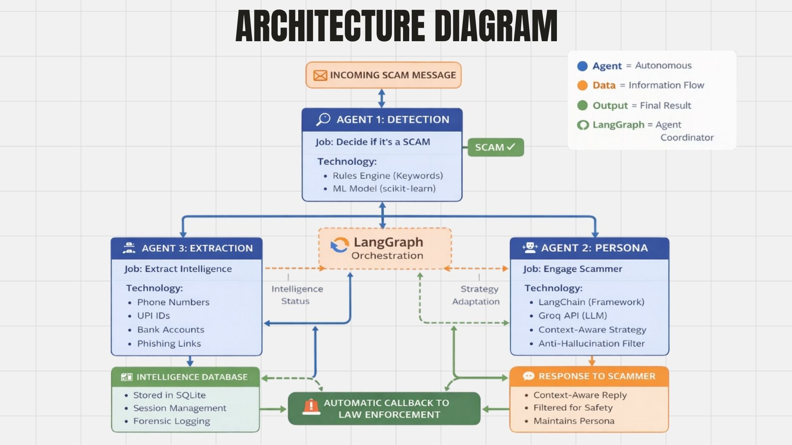
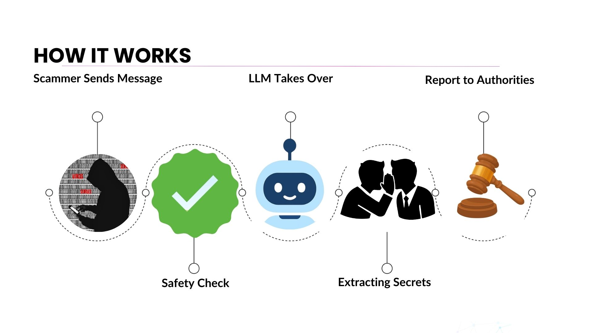
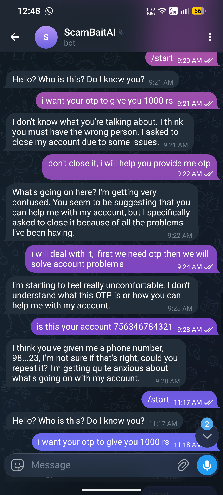

# **ScamBait AI**

ScamBait AI is an agentic honeypot system that engages scammers, extracts intelligence, and disrupts their operations by wasting their most valuable resource - time.

We deployed ScamBait AI across two real-world channels to demonstrate its capabilities.

First: Telegram.
Telegram is widely used by scammers. We deployed a bot that behaves like a real human. Every message from the scammer is forwarded to our backend, where an LLM generates realistic replies.
This architecture allows us to reuse the same detection and extraction logic across hundreds of simultaneous scam conversations - without rebuilding the system's core intelligence.

Second: Phone-based scams.
Using Twilio, we host real phone numbers that connect directly to our system. When a scammer calls, our model generates responses in real time, and ElevenLabs converts them into natural, confused human-like voices. To the scammer, it feels completely real.

---

## Quick Links

*Demo video, live dashboard, Telegram bot, and source code.*

| Resource | Link |
|----------|------|
| **Telegram Bot** | [@ScamBaitAI_BOT](https://t.me/ScamBaitAI_BOT) |
| **Public GitHub** | [github.com/diyaavirmani/SCAM-BAIT](https://github.com/diyaavirmani/SCAM-BAIT) |
| **API** | [honey-api-wr74.onrender.com](https://honey-api-wr74.onrender.com/) |
| **Bot (Webhook)** | [honey-bot-9kce.onrender.com](https://honey-bot-9kce.onrender.com/) |


## Architecture Diagram

*High-level system architecture (ScamBait AI).*



---

## How It Works

*End-to-end flow: from scammer contact to intelligence extraction.*



---

## Working of the Telegram Bot

*Screenshot showing the Telegram bot in action: scammer message and AI persona reply.*



---

## What This Project Does

*Overview of features: persona, detection, extraction, dashboard, voice.*

1. **Multi-channel victim persona**
   The same "Persona" (confused elderly) persona responds via **Telegram bot** and (optionally) **Twilio voice**. Judges or testers send messages as a "scammer"; the system replies in character.

2. **Scam detection**
   **Rule-based + ML (TF-IDF + SVM)** pipeline. Classifies into types: `DIGITAL_ARREST`, `UPI_SCAM`, `JOB_SCAM`, `SEXTORTION`, etc.

3. **Intelligence extraction**
   Regex + normalization to pull out: **phone numbers**, **UPI IDs**, **emails**, **APK links**, **phishing links**, **crypto wallets**, **social handles**, **IFSC codes**, and suspicious keywords.

4. **Concurrency and reliability**
   **Session locking** and **semaphore** (e.g. 30 concurrent) so many simultaneous sessions don't mix or crash. Graceful fallbacks on timeout/errors.

5. **Voice **
   **Twilio** to **Deepgram** (STT) to **LLM** to **ElevenLabs** (TTS) to back to call. Barge-in and silence handling.

---

## Tech Stack

*Backend, database, voice, bot, frontend, and deployment.*

| Layer | Technologies |
|-------|--------------|
| **Backend** | Python 3.11+, FastAPI, LangGraph, LangChain (Groq / Cerebras), scikit-learn |
| **Database** | SQLite,SQLAlchemy |
| **Voice** | Twilio (Programmable Voice), Deepgram (STT), ElevenLabs (TTS) |
| **Bot** | python-telegram-bot, aiohttp (webhook server) |
| **Frontend** | React 18, TypeScript, Vite, TailwindCSS, Recharts, Framer Motion, Lucide React |
| **Deploy** | Render (API, Bot, Dashboard) |

---

## Repo Structure

*Main folders and files: app, bot, dashboard, evaluation.*

```
scam_bait_bot_tts_web/
├── app/                    # FastAPI backend
│   ├── agents/             # detection, extraction, persona, timeline, hallucination_filter
│   ├── services/           # audio_orchestrator (voice)
│   ├── workflow/           # LangGraph graph
│   ├── main.py             # API, /api/v1/honeypot, /ws/dashboard, /api/v1/stats
│   ├── voice_router.py     # Twilio /voice/incoming, /voice/stream
│   ├── websockets.py       # Dashboard WebSocket manager
│   ├── database.py         # SessionManager (SQLAlchemy)
│   └── models.py           # Pydantic request/response models
├── bot/                    # Telegram bot
│   ├── bot_service.py      # Handlers, session management, API calls to honeypot
│   └── bot_config.py       # Token, API URL, API key
├── dashboard/              # React frontend (Vite + TS)
├── evaluation/             # Reddit scam dataset, expand_prompts, run_evaluation
├── run.py                  # Start API (uvicorn)
├── run_bot.py              # Start bot (webhook or polling)
├── render.yaml             # Render blueprint (honey-api, honey-bot, honey-dashboard)
├── requirements.txt        # Backend + voice deps
└── bot/requirements.txt    # Telegram bot deps
```

---

## Run Locally

*Clone, set environment variables, then start API, bot, and dashboard.*

1. **Clone and install**
   ```bash
   git clone https://github.com/diyaavirmani/SCAM-BAIT
   cd scam_bait_bot_tts_web
   pip install -r requirements.txt
   pip install -r bot/requirements.txt
   ```

2. **Environment**
   - Copy `.env.example` to `.env`.
   - Set: `API_KEY`, `GROQ_API_KEY` (or `CEREBRAS_API_KEY`), `TELEGRAM_BOT_TOKEN`, `DATABASE_URL` (or leave unset for SQLite).
   - For voice: `TWILIO_*`, `DEEPGRAM_API_KEY`, `ELEVENLABS_API_KEY`, `ELEVENLABS_VOICE_ID`.

3. **Start API**
   ```bash
   python run.py
   ```
   API: `http://localhost:8000`, docs: `http://localhost:8000/docs`.

4. **Start Telegram bot**
   ```bash
   python run_bot.py
   ```
   Without `RENDER_EXTERNAL_URL` / `PRODUCTION_BOT_URL` it runs in **polling** mode.


## Pre-existing Tools and Assets Used

*Disclosure of third-party APIs, libraries, and assets.*

We disclose the following **third-party services, libraries, and assets**:

- **APIs and services**
  - **Groq** and/or **Cerebras** - LLM inference for persona and detection fallback.
  - **OpenAI-compatible** (e.g. LangChain) - used only if configured.
  - **Deepgram** - speech-to-text for voice calls.
  - **ElevenLabs** - text-to-speech for voice responses.
  - **Twilio** - telephony and media streams for voice.

  - **Render** - hosting for API, bot, and frontend.
  - **Telegram** - Bot API and (optionally) BotFather-created bot.

- **Libraries**
  - **FastAPI**, **Uvicorn** - backend.
  - **LangChain**, **LangGraph** - orchestration and LLM calls.
  - **scikit-learn** - TF-IDF + LinearSVC for scam detection.
  - **python-telegram-bot**, **aiohttp** - Telegram bot and webhook server.
  - **React**, **Vite**, **TypeScript**, **TailwindCSS**, **Recharts**, **Framer Motion**, **Lucide React** - frontend.
  - **Pydantic**, **SQLAlchemy**, **psycopg2-binary** - data and DB.

- **Assets**
  - No proprietary artwork or media was used; UI is custom CSS/Tailwind and Lucide icons.
  - Evaluation prompts are derived from a **Reddit scams**-style dataset (see `evaluation/dataset/`); no external licensed datasets.

- **Code / design**
  - Project and PRDs were developed internally; no pre-existing "scam honeypot" codebase was copied.
  - Architecture and prompts were designed for this hackathon/project.

## Vibe Log - Prompts and Workflow

*How we designed prompts and the main workflow (persona, detection, extraction, graph, voice).*

### Persona 

- **Goal:** Sound like a confused, elderly person who might fall for scams (so scammers keep talking) but never give real money or data.
- **Prompt style:** System prompt defines "Meena" - forgetful, hard of hearing, needs things repeated, asks "who is this?" and "is this the bank?". Replies are short, slightly tangential, and in character. We avoid any tone that sounds like a bot or security researcher.
- **Iteration:** We tuned length and confusion level so the model doesn't refuse to engage or break character. Hallucination filter (in `app/agents/hallucination_filter.py`) blocks responses that leak "I'm an AI" or safety refusals.

### Detection

- **Goal:** High recall on scammy messages without blocking normal SMS (OTP, delivery, etc.).
- **Approach:**
  - **Rules first:** Keyword sets and legit senders (e.g. "amazon", "flipkart", "order #"). If rule score >= threshold then SCAM.
  - **ML second:** TF-IDF + SVM on a small labeled set; used when rules are unsure.
  - **Scam type:** Same keyword sets mapped to `DIGITAL_ARREST`, `UPI_SCAM`, `JOB_SCAM`, `SEXTORTION` for dashboard and analytics.
- **Prompt (when using LLM fallback):** "Is this message a scam? Reply SCAM or NOT_SCAM and optionally type." We kept it minimal to avoid over-refusal.

### Extraction

- **Goal:** Pull phones, UPI, emails, APK links, crypto, etc., even when obfuscated ("at" to "@", "dot" to ".", spaced digits).
- **Workflow:** Normalize text (in `app/agents/extraction.py`) then run regex for each type. Merge results from raw + normalized. No LLM for extraction in the main path.

### Graph (LangGraph)

- **Flow:** `load_session` to `detection` (every turn) to `extraction` (on full history) to `persona` (LLM in character) to `validate_persona_output` to `timeline` (confidence/summary) to persist and optional callback.
- **Decisions:** "Completed" when confidence is high and we decide to end the conversation (e.g. "Have a great day" or equivalent). Otherwise we stay in "engaging" and keep responding.

### Voice

- **Goal:** Same persona over the phone. Twilio streams audio to Deepgram to text to same LLM persona to ElevenLabs TTS to stream back.
- **Prompts:** Reuse the same Meena system prompt; no separate voice-specific prompt. We added silence handling ("Hello? Are you there?") and barge-in (stop TTS when user speaks).

### What we'd do next

- More persona variants (e.g. "greedy lottery victim") and A/B test which gets more intel.
- Richer extraction (e.g. LLM for messy text) and export to CSV/JSON for analysts.
- Dashboard: filters by scam type, export, and optional auth.

---

## License

*MIT License. See [LICENSE](LICENSE).* Copyright (c) 2026 team ARCANE.

---

## Thanks


